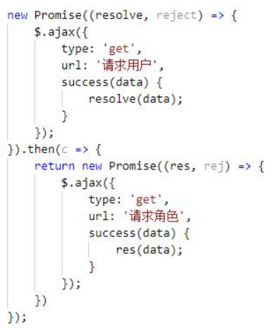

# 											笔记

# JavaScript复习

####  1.JavaScript简介

#### JS的组成 ：

###### 		ECMAScript(核心）、  DOM 文档对象模型 、BOM浏览器对象模型、

###### 		数据类型，运算符，语句，函数，数组，表达式等等，js就是属性和方法的集合，俗称：万物皆对象。


#### 数据类型的基本方法和操作:

###### 		基本的数据类型有：Number(数值) 、String(字符串)、Boolean(布尔值)、undefined(未定义)、null(空)、function(函数) 、

###### 		复杂的数据类型有:   Object（对象） Array（数组） //  需要引用


#### 运算符

######  = 赋值操作   

###### ==  判断值是否相等   

###### === 判断值和数据类型是否相等

###### +  两个值相加   

###### ++ 递增  

###### - 两个值相减   

###### --    递减  

###### /  两个值相除  

###### %  两个值磨余  

###### += 增加赋值计算或者字符串拼接  

###### -=  减少赋值计算	 

sry  	捕获一个可能发生的错误 

 catch 捕获以后执行的操作或不执行

### typeof    instanceof  toString  判断类形

###### typeof  **作用：用于判断一个一个表达式，（对象或者原始值），返回一个字符串。**

###### typeof 是一个一元运算符，放在一个运算数之前，运算数可以是任意类型。

###### 主要用于判断数据是不是基本数据类型：

###### String、Number、Object、Null、Undefined、Boolean，但是无法判断出function、array、regExp

###### 返回值是一个字符串，该字符串说明运算数的类型。

###### typeof 一般只能返回如下几个结果：

###### number、boolean、string、function、object、undefined。

###### 也可以判断变量: 比如说 if( a ==="undefined"){  }

```js
alert(typeof(1));*//number* 

alert(typeof("abc"));*//string* 

alert(typeof(true));*//boolean* 

alert(typeof(m));*//undefined*


```

**由于typeof只能判断类型，因为typeof遇到null,数组,对象时都会返回object类型，所以当我们要判断一个对象是否是数组时或者判断某个变量是否是某个对象的实例则要选择使用另一个关键语法instanceof，instanceof返回的是一个布尔值**

## instanceof

**作用：instanceof主要的目的是用来检测引用类型，返回值只有true和false，可以用来判断某个构造函数的prototype属性是否存在于另外一个要检测对象的原型链上

###### **语法：obj instanceof Object; //true 实例 obj 在不在Object构造函数中**

```js
var b = '123';
alert(b instanceof String);  //false
alert(typeof b);  //string
var c = new String("123");
alert(c instanceof String);  //true
alert(typeof c);  //objec
```

##### **instanceof只能用来判断对象和函数，不能用来判断字符串和数字等。** 

## toString()

toString()的作用：
1、toString() : 把对象转成字符串

```java
 var arr = [1,2,3];
 
        alert( typeof arr.toString() ); //类型被转为string类型了
        alert( arr.toString() ); // '1,2,3'
1234
```

2、想按照自己的方式将变量转成字符串，但又不行遵守他的规则
3、toString()应用，进位制转换

```javascript
 // 进位制转换
        var num = 255;
        // 将num转成16进制
        alert(num.toString(16) ); //'ff'
       
12345
```

4、toString()应用，例一toString()做类型的判断
每一种对象 构造函数 原型上 都有toString() 不同对象调用的toString()都是自己构造函数的原型空间

```javascript
var arr = [];
alert( Object.prototype.toString.call(arr) == '[object Array]' ); //true
```

5判断数组的解决方案

```javascript
 function getDataType(obj) {
        if(obj === null){
            return "null";
        }else if(typeof obj === "object"){
            if(obj instanceof Array){
                return "array";
            }else{
                return "object";
            }
        }else{
            return typeof obj;
        }
    }
```

## 函数 function

函数概念：函数是由事件驱动或者被调用的时候执行的可被重复利用的代码块


        函数是一组可以随时随地运行的语句
        作用：
         使程序变得简洁清晰
         易于代码维护
         提高了代码的复用性，提高程序开发的效率
    
        函数定义
           
           function 函数名(参数1，参数2){
               函数体 ---函数里面要执行的代码块
           }
           
        函数命名
    
          标识符：变量、函数、属性的名字，或者函数的参数名


        函数创建--
        第一种创建函数的方式 （- 具名函数-- - 函数声明）
        function 函数名(参数1，参数2) { 函数体 }


        第二种创建函数的方式  函数表达式-- 匿名函数
        var fun = function (参数1，参数2) { 函数体 }
    
        var fun = function (a, b) {
            return a * b;
        }
    
        console.log(fun(5, 3))


        第三种创建函数的方式，不常用。了解
    
        var fun1 = new Function('a', 'b', 'alert(a*b)');
    
        fun1(3, 4);

 形参  --函数创建的时候
 实参  ---函数调用的时候

       形参和实参一一对应
    
       实参大于形参-----
       arguments 对象 ---创建了函数，arguments存在，arguments里面存的是所有的实参;
       arguments[0]  第一个实参
       arguments[1]  第二个实参
       。。。。


       形参大于实参 -----
       
       多了的这个形参的值默认是undefined
    
        // 默认情况下，函数的返回值是undefined
        // return  1.函数的返回值   2.终止当前函数运行
##  什么是作用域?


####   *>一段代码起作用的范围我们就称之为作用域，分为全局作用域和局部作用域*

######   - 定义全局变量的三种方法

######     - 变量定义在函数外部

######     - 在函数内部定义一个不使用var声明的变量

######     - 使用window对象来定义变量

#### *> 在函数内部访问一个变量，优先在当前函数内部进行查找，如果找到了就使用该变量，*

######   如果找不到则继续向父级进行查找，最后找到window顶层对象，如果还没有找到，则提示报错，

######   这种由内向外查找变量的链条关系我们就称之为`作用域链`


#### 定时器相关方法：

        设置计时器方法
        setInterval()  间歇调用；就是每隔一段时间调用一次-间隙性计时器
        按照指定的周期（以毫秒计）来调用函数或计算表达式。方法会不停地调用函数，直到 clearInterval() 被调用或窗口被关闭。
        setTimeout()   延迟调用；指定的时间后调用一次，只调用一次   在指定的毫秒数后调用函数或计算表达式。一次性计时器    
        
        清除计时器的方法
            clearInterval()
            clearTimeout()
    
        语法：setInterval(code,millisec,lang)     setTimeout(code,millisec,lang)
            code	必需.要调用的函数或要执行的代码串。
            millisec	必须.周期性执行或调用 code 之间的时间间隔，以毫秒计。
            lang	可选. JScript | VBScript | JavaScript
预编译

 js的预解析  

      预解析的顺序是从上到下，函数的优先级高于变量，函数声明提前到当前作用域最顶端，在var之上。
###### 函数执行的时候，函数内部才会进行预解析，如果有参数，先给实参赋值再进行函数内部的预解析。

```
    1.遇到 var  function  先存到内存中，赋值undefined   全局变量a  全局函数fun1 ---在fun1里面存局部变量
    2.赋值函数提升与变量提升
    当js中函数或变量在未声明之前使用，
  那么函数或变量的声明将被提升到当前作用域的最顶部，
  这就叫变量提升
```

###### 函数的生命周期：函数运行结束--函数以及里面的变量被js的垃圾回收机制回收了

######   代码的执行顺序 ：代码从上到下执行--函数只有在调用的时候才会执行

1. ***\*对象创建的方式\****

  ***\*字面量的方式\****

```js

var person = {属性名:数字值，方法名:方法体}

   var person = {

        "name":"纪云",

        say: function(){

          //函数体

        }

      }


```


​    访问对象属性和方法的方式

   

```js
    obj.name  obj['name'];
    obj.say();

```

  \- 对象的属性的添加删除，修改

  对象.属性名 = 属性值 person.name = "小王八";

  delete(对象.属性名) 删除一个属性

  ***\*实例化对象\****

```js
    var obj = new Object();

    obj.name = "尼古拉斯.赵四";

    obj.dance = function(){

      console.log("woshi");

    }
```

  ***\*工厂模式\****

```js
  function car(){

      var obj = **new** Object();

      obj.brand = "兰博基尼.byd";

      obj.pl  = "1.80T";

      obj.run = function(){

      }

      //返回对象

      return obj;

    }

    var obj1 = car();
```

  ***\*构造函数模式\****

```js
function Phone(){

      this.brand = "诺基亚8880",

      this.calls = function(){

      }

    }

    

    var obj = **new** Phone();

    

    obj.brand;

    obj.calls();
```


2. ***\*工厂模式和构造函数模式的区别\****

  **工厂模式**

  \- 函数内部实例话对象，把实例化的对象返回

  \- 函数内部使用实例化对象变量设置属性和方法

  \- 直接调用函数，无需实例化

  **构造函数模式**

  \- 函数内部无需实例化对象,无需返回对象

  \- 函数内部使用this设置属性和方法

  \- 函数外部使用new关键字实例化调用

**##### 原型**

***\*什么是原型\***

###### *> 一个函数能够被是实例化他就是构造函数*

###### *> js中的每一个构造函数都有一个prototype对象属性，这个属性就是函数的原型*

 ***\*原型的优缺点是什么\***

###### *> 优点：*

######  构造函数的所有实例化对象都可以共享函数原型的属性和方法

######  delete(对象.属性名)

######  >缺点:

######  函数的原型delete方法删除不掉


### 正则表达式

***\*什么是正则表达式?\****

  \- 基本概念

​    \- 字符串匹配，查询，替换的一种模式，外表风骚，内功强大。

  \- 表达式的结构

​    

​    \- `/正则表达式结构/修饰符` 比如 `/\d{12}/g`

​    \- g 全局匹配 global  hello world

​    \- i 忽略大小写 ignore

***\*正则创建的方法\****


######   \- 字面量的方式

```js
var rep = /^1[34578]\d{9}$/
```

######   \- 构造函数的方式


```js
var rep = **new** RegExp("表达式","修饰符")
//比如下面匹配一个手机号
var rep = **new** RegExp("^1[34578]\d{9}$");
```
**js中使用正则表达式**

  - 字符串中可以使用正则表达式的三个函数
    ```js
            string.replace("正则表达式","要替换的对象")
            string.match("正则表达式")
            string.search("正则表达式")
    ```
    
    - test方法
        ```js
            var rep = /正则表达式/g
            rep.test(要验证的字符串); //结构返回true或者false
        ```

    - exec方法

        ```js
            var rep = /正则/g
            rep.exec(string) //返回一个数组，包含第一个匹配到的值，
        ```

### 递归

  正在更新.....

### 严格模式
1. 严格模式：使JS编码更加规范化的模式,消除Javascript语法的一些不合理、不严谨之处，减少一些怪异行为，在严格的条件下运行。严格模式中体现了Javascript更合理、更安全、更严谨的发展方向，IE 10在内的主流浏览器。
2. 设立严格模式的原因：
   1）消除Javascript语法的一些不合理、不严谨之处，减少一些怪异行为
   2）消除代码运行的一些不安全之处，保证代码运行的安全
   3）提高编译器效率，增加运行速度
   4）为未来新版本的Javascript做好铺垫
3. 开启严格模式：
   1）“use strict”; 是进入严格模式的标志。
   2） 将"use strict"放在脚本文件的第一行，则整个脚本都将以"严格模式"运行。如果这行语句不在第一行，则无效，整个脚本以"正常模式"运行。从严格意义上来说，只要前面不是产生实际运行结果的语句，"use strict"可以不放在脚本文件的第一行。
   3）在全局作用域使用的话,那整个js脚本就会开启这种模式。
   4）如果是只在函数内部使用的话,那么就只是该函数内部开启而已
4. 调用脚本
   1）针对整个脚本文件：
   a. 将"use strict"放在脚本文件的第一行，整个脚本都将以严格模式运行。如果这行语句不在第一行就无效，整个脚本会以正常模式运行。

   ### promise




1. 概述：Promise是异步编程的一种解决方案，从语法上讲，Promise是一个对象，可以获取异步操作的消息
2. 使用的目的： （1）、避免回调地狱的问题（2）、Promise对象提供了简洁的API，使得控制异步操作更加容易
3. Promise有三种状态：pendding //正在请求，rejected //失败，resolved //成功
4. 基础用法：new Promise(function(resolve,reject){ })
5. resolved,rejected函数：在异步事件状态pendding->resolved回调成功时，通过调用resolved函数返回结果；当异步操作失败时，回调用rejected函数显示错误信息
6. then的用法：then中传了两个参数，第一个对应resolve的回调，第二个对应reject的回调

```javascript
p.then((data) => {
            console.log('resolved',data);
        },(err) => {
            console.log('rejected',err);
        }
    );
123456
```

1. catch方法：捕捉promise错误函数，和then函数参数中rejected作用一样，处理错误，由于Promise抛出错误具有冒泡性质，能够不断传递，会传到catch中，所以一般来说所有错误处理放在catch中，then中只处理成功的，同时catch还会捕捉resolved中抛出的异常

```javascript
p.then((data) => {
    console.log('resolved',data);
})
.catch((err) => {
    console.log('rejected',err);
});
123456
```

1. all方法：Promise.all([promise1,promise2])——参数是对象数组。以慢为准，等数组中所有的promise对象状态为resolved时，该对象就为resolved；只要数组中有任意一个promise对象状态为rejected，该对象就为rejected

```javascript
let p = Promise.all([Promise1, Promise2])

p.then((data) => {
    //都成功才表示成功
})
.catch((err) => {
    //有一个失败，则都失败
});
12345678
```

1. race方法：Promise.race([promise1,promise2])——参数是对象数组。以快为准，数组中所有的promise对象，有一个先执行了何种状态，该对象就为何种状态，并执行相应函数